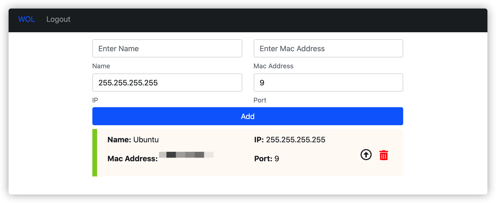

# wol-web

Deployment Instructions:

- [Deployment Instructions](./deploy.md)
- [Deploy App](#deploy-app)
- [Deploy With Docker Image](#deploy-with-docker-image-Recommended)

## Use Cases

A web app hosted locally for **wakeonlan**, turn on computers in private network.

Use VPN to go into your network and wake up your computers with a simple click in your browser.

**Frontend:** Vue.js + TypeScript

**Backend:** golang + fiber

## UI



## To Develop

### Frontend

```bash
npm i -g @vue/cli
cd frontend
npm install
npm run serve
```

### Database

```bash
docker run --name wol-db \
-e POSTGRES_PASSWORD=wakeonlan \
-e POSTGRES_USER=wol \
-e POSTGRES_DB=wol \
-e PGDATA=/var/lib/postgresql/data/pgdata \
-v wol-web-db:/var/lib/postgresql/data \
--rm -p 5432:5432 postgres:13.2-alpine
```

or

```bash
docker-compose run db
```

or a actual local postgres database

### Backend

```bash
cd backend
go get -u github.com/cosmtrek/air
# add go/bin to path
export PATH=/home/username/go/bin:$PATH   # on linux, similar on mac
air                                     # start live reload
```

#### Run backend with docker-compose

```bash
docker-compose -f docker-compose-helpers.yml run dev-backend
```

See [backend](./backend/README.md) and [Environment Variables](#environment-variables) for more configuration options.

## Docker Environment

The app can be hosted with docker which requires the machine to have `docker` and `docker-compose` installed.

If you want to run it without docker (with native golang), see later sections: [Deploy Without Docker](#deploy-without-docker)

Modify the image tags within `docker-compose.yml` and `docker-compose-helpers.yml` depend on what machine you are running.

### x64

#### golang image:

- golang:1.16.3-alpine3.13

#### postgres image:

- postgres:13.2

### raspberry pi (arm)

#### golang image:

- arm32v7/golang:1.16.3-alpine3.13

#### postgres image:

- arm32v7/postgres:13.2

#### Other Arm Libraries

> replace arm32v7 with any of the following based on your arm device
> e.g. `arm64v8/postgres:13.2`

- arm32v5
- arm32v6
- arm32v7
- arm64v8

## Build Frontend Manully

The frontend is written in vuejs and needs to be built manually to generate a `dist` folder which contains the `index.html` and other resources.

### Manual Installation and Build

If you have nodejs 15+, npm on your machine, you can cd into **frontend** and run

```bash
sudo npm install -g @vue/cli        # if you don't have vue on your machine.
npm install
npm run build
```

### Build with docker-compose (recommended)

If you don't have the dependencies installed, you can use **docker-compose** to build the frontend production build.

```bash
docker-compose -f docker-compose-helpers.yml run build-frontend
```

### Build with Makefile (recommended)

```bash
make build-frontend     # exactly the same as the docker-compose method, just a simplified wrapper
```

## Backend

For more information and configuration related to backend, check [backend README](./backend/README.md)

You can configure

- database user, password
- port of the server
- number of users allowed to sign up
- Timezone of Database
- JWT Secret and Login Time (JWT_VALID_TIME)

## Deploy App

For simple samples: [deploy.md](./deploy.md)

### docker-compose (Recommended)

```bash
docker-compose up       # see debug messages if doesn't run
docker-compose up -d    # run in detach mode to show no messages
```

Run the app without `-d` first to confirm that it's running properly (see error messages if any) then run with `-d`.

### Makefile version

The following 2 make commands are exactly the same as the 2 docker-compose commands above

```bash
make deploy-test
make deploy
```

## Deploy with Docker Image (Recommended)

Also see: [deploy.md](./deploy.md)

Docker Image contains both compiled frontend and server code, which you don't need to compile by your self.

```bash
docker pull huakunshen/wol:latest
docker pull huakunshen/wol:mac10.15.7
docker pull huakunshen/wol:raspberrypi4
```

You still need to start a postgres Database

Check [deploy.md](./deploy.md) or [Start Database](./backend/README.md#set-up-postgresql-database-with-docker) for how to run a database.

To start the backend:

```bash
docker run -d --restart=unless-stopped --name wol-server --network host huakunshen/wol:latest
```

**While running database and the app, make sure you use the same environment variables**

### Dockerfile

There 2 versions of Dockerfile used to build docker image.

- [Dockerfile](./Dockerfile)
  - build both vue frontend and golang server into the image
- [with-frontend.Dockerfile](./with-frontend.Dockerfile)
  - skip frontend build, instead, take the `dist` under frontend compiled locally and add to the image.
  - `dist` is for browser thus compatible on any device. I couldn't always build it on raspberry pi, so the solution was to build on my PC and transfer and raspberry pi, and build the image.

#### Raspberry Pi Image

For Raspberry Pi, you can use the following image, only tested on pi4

```bash
docker pull huakunshen/wol:raspberrypi4
```

## Environment Variables

Environment Variables can be add by:

- adding `environment:` to service or
- adding `-e env_name=env_value` to `docker run`

### Database

```
POSTGRES_PASSWORD=wakeonlan
POSTGRES_USER=wol
POSTGRES_DB=wol
PGDATA=/var/lib/postgresql/data/pgdata
```

### Server

```
PORT=9090
JWT_SECRET=secret
JWT_VALID_TIME=14400

POSTGRES_HOST=localhost

POSTGRES_PORT=5432
POSTGRES_USER=wol
POSTGRES_PASSWORD=wakeonlan
POSTGRES_DB=wol
POSTGRES_TIMESZONE=America/Toronto

NUM_USER_ALLOWED=1
```

During development, both Database and Server environment variables can be modifed in `backend/.env`

check [backend](./backend/README.md) too.
